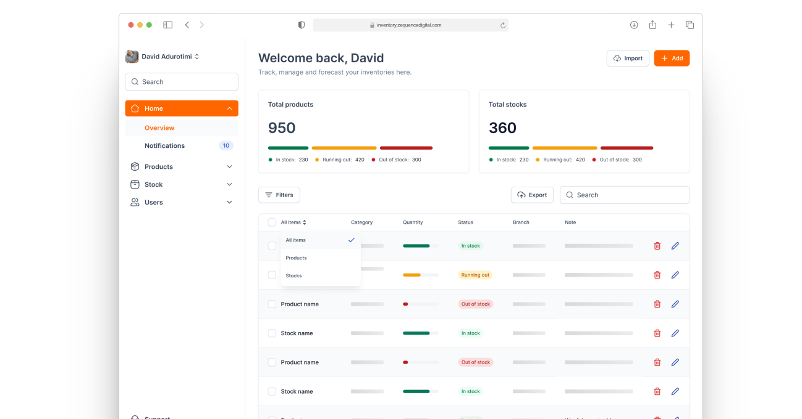

# The Zequence Digital Inventory Management Application

## Overview

The Inventory Management Application is designed to help businesses efficiently manage their inventory. It provides features for tracking stock levels, managing suppliers, and generating reports.

- **Stock Management**: Track and manage stock levels for various products.
- **Product Management**: Track and manage product levels.
- **Reporting**: Generate reports on stock levels, sales, and more.
- **User Management**: Manage user roles and permissions.
